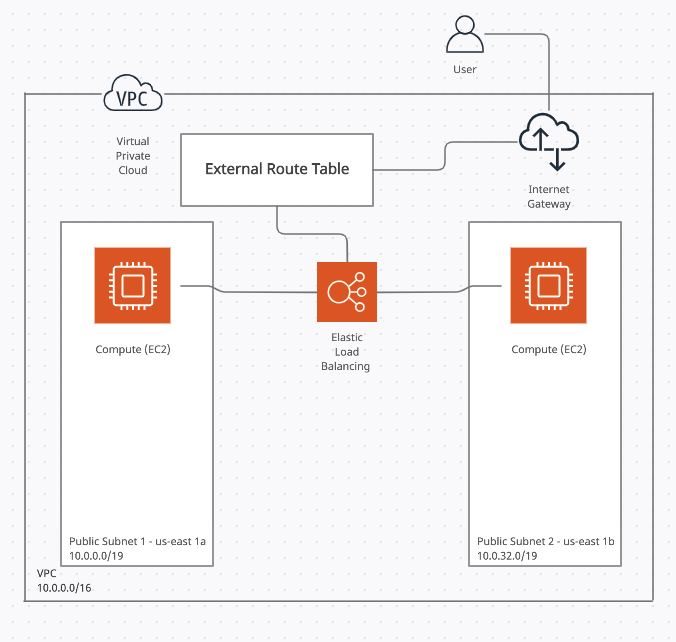

# Amazon Web Services

At my current job we use Amazon Web Services (AWS) quite a bit to provision resources for clients

So because of this requirement it means that I need to learn about AWS and how to properly use it and configure it.

This is also preparation for my AWS Certification exam.

In this Document i'm going to cover some basic AWS Principles and set up a mini-project that uses load balancing to distribute traffic between two web servers.

> This is a simple diagram of the AWS architecture i'm going to be using for this project. During this project we will probably expand this to include 2 S3 Buckets (One for main object storage and the other as a backup in a different availability zone) plus a [Lambda](https://aws.amazon.com/lambda/?nc2=h_ql_prod_serv_lbd) function to run and maintain our backup

So follow along!