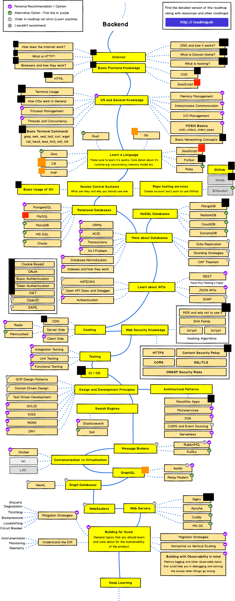

# Backend Developer Journey

Hi, My name is [Kodey Thomas](https://twitter.com/ThomasKodey) and i'm a 16 year old programmer. During this recent quarantine I started thinking
**What Do I Actually Know?** and taking a step back i realised it's so much better to spend this time doing something productive and learning new skills to help me in my future endeavours.

> The rest of this `README.md` is about my personal life and the derivations I am going to make to the roadmap, if you just want to get started head into the first folder labelled `01-JavaScript` however I recommend you read the rest of this as it gives you a good understanding of where my skills were before starting this project.

### So, what exactly is this...

This is mainly a personal project to see the progression through my skills. I am going to be following the [Backend Developer Roadmap](https://roadmap.sh/backend) and ticking of what I know already and understand. Think of this like `100 days of code` except I can't leave my house or there is a chance of death.

### What skills do I already know

Currently at the start of quarantine I could code in Python, HTML and Batch (Although I don't particularly class that as a language) and that was it. I understood most concepts within Computing at a basic / intermediate level. Ever since I was a kid I was really interested in code and how stuff worked, I remember owning an even old for my time Windows XP desktop, We didn't have access to the internet so I had to learn programming in Batch from books I borrowed from the library which was certainly a challenge compared to today in the age of [StackOverflow](https://stackoverflow.com). I have technically been coding for ~ 5 years (from the date I first learned about Python) however it has been odd projects here and there without any dedication to really learning something. I then discovered [Kali Linux](https://kali.org) or as it was called when I found out about it [Backtrack](https://www.backtrack-linux.org) little 2011 Kodey was so happy about this new tool that he could learn how to use and thus began how I found out about Linux.

Here is a sample of my HTML skills which you can find on my site [HERE](https://kodeycodesstuff.tech)

### Deviations I am going to make to the roadmap

I always was interested in jailbreaking and the art of bypassing security measures put in place to prevent you from doing certain things so ever since the [Unc0ver](https://unc0ver.dev) jailbreak came out for iOS 13.5 I told my self I was going to learn how to create tweaks, and i'm incredibly glad I did and made some cool friends along the way. So I learnt how to make tweaks and this process included learning about the following;

- Objective-C
- Logos Syntax
- [MobileSubstrate](http://www.cydiasubstrate.com/id/264d6581-a762-4343-9605-729ef12ff0af/) and it's application in jailbreak tweaks (MobileSubstrate Extensions)
- Method Swizzling and Dynamic Runtime Patching
- Bypassing Jailbreak Detection and common patterns to detect jailbreaks
- Finding what methods to hook by using Headers
- iOS ASLR + Binary Encryption (And how to reverse it to find the real address)
- Frida and what is it, how we can use it in numerous applications including decrypting binaries
- Basic Reverse Engineering including learning basic `ARM` assembly
- Using Hopper and IDA Pro to extract unencrypted strings from the binary
- What `Mach-O` binaries are and the differences between a FAT binary and a THIN binary
- What `.dylib`'s or `Dynamic Libraries` are and there application within `Tweak Development`

> I do fully understand this isn't backend development but mobile development however the additional skills it has taught me on how the 'backend' of iOS works allows it to be included here

At the time of writing it has been 58 Days since I started this Journey as that has been the length of time the [Unc0ver](https://unc0ver.dev) Jailbreak has been out. I however did find there wasn't many decent tutorials on `Tweak Development` so I decided to make my own which you can find [HERE](https://kodeycodesstuff.tech/guide) this is probably one of my proudest works at it took ~3 days to complete as I was learning the guide as I was writing it and was incredibly challenging however I am really glad I wrote it as it has been used by **13.5K Unique Users** in the past month !

### The Roadmap I Will be following

So the roadmap I will be following can be found [HERE](https://roadmap.sh/backend) but I can already do a few things on there, so I shall be ticking off what I already can do to simplify the process.

So here is the edited roadmap I will be following

